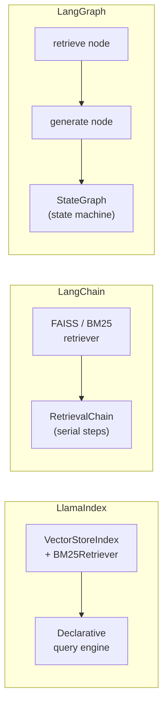

# RAG Experiment: LlamaIndex vs LangChain vs LangGraph

A RAG (Retrieval-Augmented Generation) experiment that compares six similarity algorithms across three frameworks: LlamaIndex, LangChain, and LangGraph.  
Both the LLM and embedding model run **locally via Ollama**, so there are no API costs.

---

## System Overview

How the experiment works end-to-end:


### RAG query flow


### Framework differences



All three frameworks share the same chunk store, embedding model, and similarity backends so the comparison stays fair.

---

## Experiment Setup

| Item | Details |
|------|---------|
| LLM | `gemma4:26b` via Ollama (local, free) |
| Embedding | `nomic-embed-text` via Ollama (768-dim, local, free) |
| Frameworks | LlamaIndex, LangChain, LangGraph |
| Similarity methods | cosine, euclidean, dot_product, manhattan, bm25, hybrid(RRF) |
| Data | Samsung refrigerator user manual PDF (88 pages → 238 chunks) |
| Queries | 15 English questions about home appliances |

---

## Project Structure

```
RAG_Experiment/
├── data/
│   └── pdfs/                   # PDFs used for the experiment
├── experiments/
│   ├── run_experiments.py      # Main experiment runner
│   └── sample_queries.py       # 15 test queries
├── src/
│   ├── config.py               # Experiment config (models, chunking, top-k, etc.)
│   ├── data_loader.py          # PDF loading and chunking
│   ├── embeddings.py           # Ollama embedding HTTP wrapper
│   ├── similarity_search.py    # Six similarity search implementations
│   ├── llamaindex_rag.py       # LlamaIndex RAG pipeline
│   ├── langchain_rag.py        # LangChain RAG pipeline
│   ├── langgraph_rag.py        # LangGraph StateGraph pipeline
│   ├── evaluator.py            # Result evaluation (context relevance, etc.)
│   └── visualizer.py           # Result visualization (dynamic N-framework support)
├── results/
│   ├── plots/                  # Generated comparison charts
│   └── raw/                    # Experiment result JSON
├── notebooks/
│   └── analysis.ipynb          # Result analysis notebook
├── .env.example                # Environment variable template
└── requirements.txt
```

---

## Framework Comparison

| Framework | Approach | Characteristics |
|-----------|----------|-----------------|
| **LlamaIndex** | VectorStoreIndex + BM25Retriever | Declarative index structure; broad retriever support |
| **LangChain** | FAISS Vectorstore + RetrievalChain | Chain-based pipeline; large integration ecosystem |
| **LangGraph** | `retrieve → generate` StateGraph | State-machine based; extensible per-node design |

---

## Similarity Algorithms

| Method | Description |
|--------|-------------|
| `cosine` | FAISS IndexFlatIP + L2-normalized vectors |
| `euclidean` | FAISS IndexFlatL2 |
| `dot_product` | FAISS IndexFlatIP (no normalization) |
| `manhattan` | sklearn L1 distance |
| `bm25` | Sparse keyword-based BM25Okapi |
| `hybrid` | BM25 + cosine fused with RRF (Reciprocal Rank Fusion) |

---

## Experiment Results

### LangChain

| Method | Total latency (s) | Context relevance |
|--------|:-----------------:|:-----------------:|
| cosine | 6.82 | **0.6245** |
| euclidean | 7.02 | **0.6245** |
| dot_product | 7.36 | **0.6245** |
| manhattan | 7.87 | 0.6232 |
| hybrid | 8.23 | 0.5949 |
| bm25 | **6.43** | 0.5072 |

### LangGraph

| Method | Total latency (s) | Context relevance |
|--------|:-----------------:|:-----------------:|
| cosine | 6.97 | **0.6245** |
| euclidean | **6.75** | **0.6245** |
| dot_product | 7.05 | **0.6245** |
| manhattan | 7.44 | 0.6232 |
| hybrid | 8.15 | 0.5949 |
| bm25 | 6.31 | 0.5072 |

> **Context relevance**: mean cosine similarity between retrieved chunks and the query vector  
> At the same retrieval quality, LangGraph was slightly faster than LangChain on some methods  
> (Both use the same FAISS/BM25 backends — the difference is StateGraph overhead vs serial chain overhead)

---

## Setup & Run

### 1. Install Ollama and pull models

Install from [ollama.com](https://ollama.com/download/mac), then:

```bash
ollama pull nomic-embed-text   # embedding model (~274MB)
ollama pull gemma4:26b         # LLM (~16GB)
```

### 2. Python environment

```bash
python3 -m venv venv
source venv/bin/activate
pip install -r requirements.txt
```

### 3. Environment variables

```bash
cp .env.example .env
```

### 4. Run experiments

```bash
# Full comparison across all 3 frameworks (default)
python experiments/run_experiments.py

# Similarity search only (no LLM calls)
python experiments/run_experiments.py --similarity-only

# Specific framework(s)
python experiments/run_experiments.py --frameworks langchain
python experiments/run_experiments.py --frameworks langgraph
python experiments/run_experiments.py --frameworks llamaindex langchain langgraph

# Specific method(s)
python experiments/run_experiments.py --frameworks langchain langgraph --methods cosine bm25 hybrid

# Override model directly
python experiments/run_experiments.py --llm-provider ollama --llm-model gemma4:26b
```

---

## Outputs

After a run finishes, these files are written under `results/`:

| File | Contents |
|------|----------|
| `plots/framework_comparison.png` | **Direct 3-framework comparison** (relevance + latency) |
| `plots/latency_comparison.png` | Per-framework latency breakdown (retrieval + gen) |
| `plots/context_relevance.png` | Context relevance by similarity method × framework |
| `plots/heatmap_avg_ctx_relevance.png` | Relevance heatmap |
| `plots/heatmap_total_time_s.png` | Latency heatmap |
| `plots/summary.csv` | Full summary table |
| `raw/rag_results_*.json` | Per-query raw results |
| `raw/similarity_only.json` | Standalone similarity search benchmark |

---

## Environment Variables (.env)

```env
OLLAMA_BASE_URL=http://localhost:11434
LLM_MODEL=gemma4:26b
EMBEDDING_MODEL=nomic-embed-text
```
