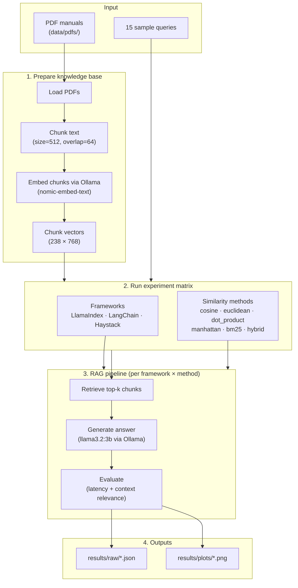
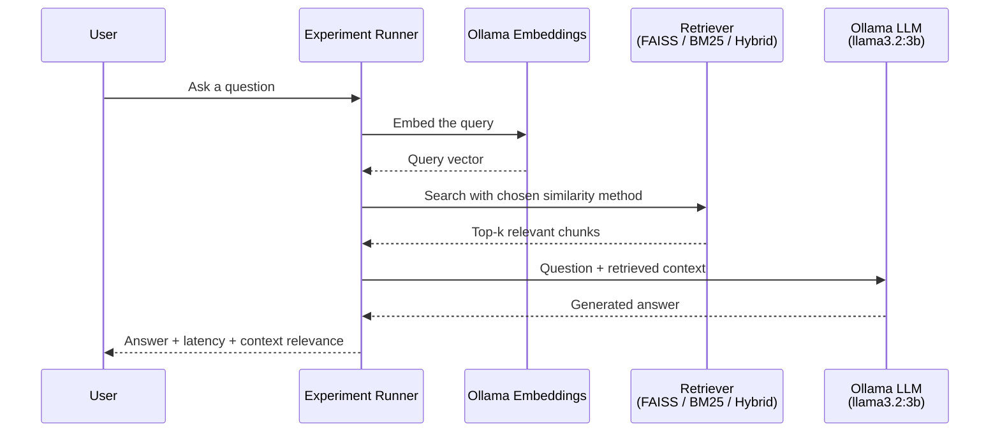
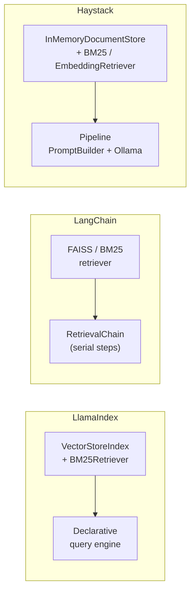

# RAG Experiment: LlamaIndex vs LangChain vs Haystack

A RAG (Retrieval-Augmented Generation) experiment that compares six similarity algorithms across three peer RAG frameworks: LlamaIndex, LangChain, and Haystack.  
Both the LLM and embedding model run **locally via Ollama**, so there are no API costs.

---

## System Overview

How the experiment works end-to-end:



### RAG query flow



### Framework differences



All three frameworks share the same chunk store, embedding model, and similarity backends so the comparison stays fair.

---

## Experiment Setup

| Item | Details |
|------|---------|
| LLM | `llama3.2:3b` via Ollama (local, free) — also works with `gemma4:26b` |
| Embedding | `nomic-embed-text` via Ollama (768-dim, local, free) |
| Frameworks | LlamaIndex, LangChain, Haystack |
| Similarity methods | cosine, euclidean, dot_product, manhattan, bm25, hybrid(RRF) |
| Data | Appliance user-manual PDF (`data/pdfs/appliance_manual.pdf`, 15 pages → 9 chunks) |
| Queries | 15 English questions about home appliances |

---

## Project Structure

```
RAG_Experiment/
├── data/
│   └── pdfs/                   # PDFs used for the experiment
├── experiments/
│   ├── run_experiments.py      # Main experiment runner
│   ├── ask.py                  # Interactive single-question RAG CLI
│   └── sample_queries.py       # 15 test queries
├── src/
│   ├── config.py               # Experiment config (models, chunking, top-k, etc.)
│   ├── data_loader.py          # PDF loading and chunking
│   ├── embeddings.py           # Ollama embedding HTTP wrapper (+ disk cache)
│   ├── prompts.py              # Shared answer prompt
│   ├── rrf.py                  # Shared Reciprocal Rank Fusion helper
│   ├── report.py               # Markdown comparison report writer
│   ├── factory.py              # Shared RAG pipeline factory
│   ├── similarity_search.py    # Six similarity search implementations
│   ├── llamaindex_rag.py       # LlamaIndex RAG pipeline
│   ├── langchain_rag.py        # LangChain RAG pipeline
│   ├── haystack_rag.py         # Haystack Pipeline RAG
│   ├── evaluator.py            # Result evaluation (context relevance, etc.)
│   └── visualizer.py           # Result visualization (dynamic N-framework support)
├── results/
│   ├── plots/                  # Generated comparison charts
│   └── raw/                    # Experiment result JSON
├── notebooks/
│   └── analysis.ipynb          # Result analysis notebook
├── .cache/embeddings/          # On-disk embedding cache (gitignored)
├── .env.example                # Environment variable template
└── requirements.txt
```

---

## Framework Comparison

| Framework | Approach | Characteristics |
|-----------|----------|-----------------|
| **LlamaIndex** | VectorStoreIndex + BM25Retriever | Declarative index structure; broad retriever support |
| **LangChain** | FAISS Vectorstore + RetrievalChain | Chain-based pipeline; large integration ecosystem |
| **Haystack** | InMemoryDocumentStore + Pipeline | Component pipeline (retriever → prompt → generator); search-first design |

---

## Similarity Algorithms

| Method | Description |
|--------|-------------|
| `cosine` | FAISS IndexFlatIP + L2-normalized vectors |
| `euclidean` | FAISS IndexFlatL2 |
| `dot_product` | FAISS IndexFlatIP (no normalization) |
| `manhattan` | sklearn L1 distance |
| `bm25` | Sparse keyword-based BM25Okapi |
| `hybrid` | BM25 + cosine fused with RRF (Reciprocal Rank Fusion) |

---

## Experiment Results

Results below are from a full re-run on the appliance manual corpus with `llama3.2:3b` (same model for all frameworks).

### LlamaIndex

| Method | Total latency (s) | Context relevance |
|--------|:-----------------:|:-----------------:|
| cosine | 1.93 | 0.6233 |
| euclidean | 0.70 | 0.6233 |
| dot_product | **0.70** | 0.6233 |
| manhattan | 1.63 | **0.6235** |
| hybrid | 1.47 | 0.6186 |
| bm25 | 1.61 | 0.6045 |

### LangChain

| Method | Total latency (s) | Context relevance |
|--------|:-----------------:|:-----------------:|
| cosine | 1.75 | **0.6236** |
| euclidean | **0.79** | **0.6236** |
| dot_product | 0.83 | **0.6236** |
| manhattan | 1.09 | 0.6235 |
| hybrid | 1.56 | 0.6171 |
| bm25 | 1.64 | 0.6038 |

### Haystack

| Method | Total latency (s) | Context relevance |
|--------|:-----------------:|:-----------------:|
| cosine | 1.23 | **0.6236** |
| euclidean | 0.94 | **0.6236** |
| dot_product | 0.96 | **0.6236** |
| manhattan | **0.88** | 0.6235 |
| hybrid | 1.36 | 0.6194 |
| bm25 | 1.59 | 0.6037 |

> **Context relevance**: mean cosine similarity between retrieved chunks and the query vector  
> Dense retrieval quality is nearly identical across frameworks (~0.623–0.624)  
> At similar relevance, LangChain / LlamaIndex were fastest on some dense methods; Haystack was competitive overall and fastest on manhattan  
> All three are peer RAG libraries (index / retriever / generator), not agent orchestration layers

---

## Setup & Run

### 1. Install Ollama and pull models

Install from [ollama.com](https://ollama.com/download/mac), then:

```bash
ollama pull nomic-embed-text   # embedding model (~274MB)
ollama pull llama3.2:3b        # LLM used for published results (~2GB)
# ollama pull gemma4:26b       # optional larger model (~16GB)
```

### 2. Python environment

```bash
python3 -m venv venv
source venv/bin/activate
pip install -r requirements.txt
```

### 3. Environment variables

```bash
cp .env.example .env
```

### 4. Run experiments

```bash
# Full comparison across all 3 frameworks (default)
python experiments/run_experiments.py

# Similarity search only (no LLM calls)
python experiments/run_experiments.py --similarity-only

# Force re-embed (skip on-disk cache)
python experiments/run_experiments.py --no-embed-cache

# Specific framework(s)
python experiments/run_experiments.py --frameworks langchain
python experiments/run_experiments.py --frameworks haystack
python experiments/run_experiments.py --frameworks llamaindex langchain haystack

# Specific method(s)
python experiments/run_experiments.py --frameworks langchain haystack --methods cosine bm25 hybrid

# Smoke test with a small query subset
python experiments/run_experiments.py --limit-queries 3 --frameworks langchain --methods cosine

# Override model directly
python experiments/run_experiments.py --llm-provider ollama --llm-model llama3.2:3b

# Ask a single question interactively (uses cached embeddings when available)
python experiments/ask.py "How do I clean the air conditioner filter?"
python experiments/ask.py --framework haystack --method bm25
```

---

## Outputs

After a run finishes, these files are written under `results/`:

| File | Contents |
|------|----------|
| `plots/framework_comparison.png` | **Direct 3-framework comparison** (relevance + latency) |
| `plots/latency_comparison.png` | Per-framework latency breakdown (retrieval + gen) |
| `plots/context_relevance.png` | Context relevance by similarity method × framework |
| `plots/heatmap_avg_ctx_relevance.png` | Relevance heatmap |
| `plots/heatmap_total_time_s.png` | Latency heatmap |
| `plots/summary.csv` | Full summary table |
| `plots/report_latest.md` | Markdown comparison report (also timestamped `report_*.md`) |
| `raw/rag_results_*.json` | Per-query raw results |
| `raw/similarity_only.json` | Standalone similarity search benchmark |

---

## Environment Variables (.env)

```env
OLLAMA_BASE_URL=http://localhost:11434
LLM_MODEL=llama3.2:3b
EMBEDDING_MODEL=nomic-embed-text
EMBEDDING_CACHE=true
```
